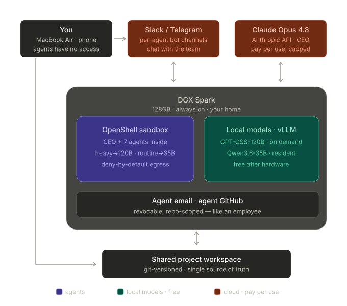

# Infrastructure Architecture

> **Authority:** [`../CLAUDE.md`](../CLAUDE.md) is the agents' operating contract.
> [`master-plan.md`](master-plan.md) is the source of truth for every version, workaround,
> and security decision behind this topology.

---

## Topology (one screen)

### The wall — operator side

**You (operator)** work from a MacBook and phone. The agents have **no access** to your machine,
banking credentials, password store, or primary email. All communication with the agent team
flows through **Slack and Telegram** channels — the bus is one-way on the trust boundary: you
reach in, the agents never reach out beyond their allowlist.

### Slack / Telegram bus

Slack and Telegram are the **human-facing projection** of the task queue. Channels are
write-through — every message corresponds to a queue entry in `tasks/queue/`. If Slack goes
down, dispatch continues from the queue; the channels are never the authoritative store.

### Opus CEO (capped)

The **CEO** runs on `anthropic/claude-opus-4-8` via the Anthropic API. It is the only agent
that reaches `api.anthropic.com`; all other agents use local vLLM models. The CEO is
**spend-capped**: it decomposes operator goals into queue tasks, routes them to the right agent,
and escalates to the operator (never to itself) on block or 3 consecutive failures. Effort
defaults to `high`; `xhigh`/`max` are reserved for hard tasks.

### DGX Spark — OpenShell sandbox

The **NVIDIA DGX Spark** (GB10, 128 GB unified memory, aarch64 DGX OS) runs at home, always-on.
NemoClaw hosts an **OpenShell sandbox** that contains the entire agent team.

**Egress is deny-by-default.** Only explicitly allowlisted `(endpoint, binary, method)` triples
pass the sandbox wall. Configuration lives in `config/openshell-policy.yaml`. Nothing not in
that file can leave the box. See `runbooks/kill-switch.md` for recovery if a rule needs
emergency revocation.

**8 OpenClaw agents** run inside the sandbox:

| Agent | Tier | Model |
|---|---|---|
| CEO | CEO (Anthropic API) | `claude-opus-4-8` |
| PA | Routine (resident) | `Qwen3.6-35B-A3B-NVFP4` |
| PM | Routine (resident) | `Qwen3.6-35B-A3B-NVFP4` |
| Architect | Heavy (on-demand) | `gpt-oss-120b` MXFP4 |
| Coder | Heavy (on-demand) | `gpt-oss-120b` MXFP4 |
| QA | Heavy (on-demand) | `gpt-oss-120b` MXFP4 |
| Security | Heavy (on-demand) | `gpt-oss-120b` MXFP4 |
| DevOps | Routine (resident) | `Qwen3.6-35B-A3B-NVFP4` |

**Local vLLM models** — two ports, two tiers:
- **`:8001` — routine, always-resident:** `Qwen3.6-35B-A3B-NVFP4` (PA / PM / DevOps / CEO fan-out). Started by `scripts/04-serve-qwen-resident.sh`.
- **`:8002` — heavy, on-demand:** `gpt-oss-120b` MXFP4 (Architect / Coder / QA / Security). Started by `scripts/03-serve-120b.sh`. UMA page-cache flushed first (`scripts/05-drop-caches.sh`).

Phase-1 upgrade path: front both ports with llama-swap + LiteLLM to collapse them behind one
endpoint (master plan §2); update `config/openclaw.json` baseUrls at that point.

**Revocable agent identities:** each agent has its own email address and GitHub account
(`agents/<id>/IDENTITY.md`). If an agent is compromised, revoke its credentials independently
without touching the others. The operator's primary email and GitHub are never exposed to the
sandbox.

### Git workspace — the bridge

The **shared git workspace** is the bridge between operator and agents, and the dispatch spine.
`tasks/queue/` (one file per task) is the single source of truth; Slack/Telegram are a
projection. Agents work on per-agent branches; a single scribe commits shared-workspace changes.
`main` is protected — no force-push, no rebase. A `git fsck` assertion runs before any turn
consumes the prefill.

---

## Key config files

| File | Purpose |
|---|---|
| `../CLAUDE.md` | Agents' operating contract — conventions, model IDs, pinned versions |
| `master-plan.md` | Every version, workaround, and security decision |
| `config/openclaw.json` | Per-agent model routing (vLLM + Anthropic CEO) |
| `config/openshell-policy.yaml` | deny-by-default egress allowlist, per-agent scoped |
| `runbooks/kill-switch.md` | 4-step runaway-agent recovery |
| `runbooks/rollout-phases.md` | Staged rollout: Phase 1 (CEO+PA+Coder+DevOps) → Phase 2 → Phase 3 |
